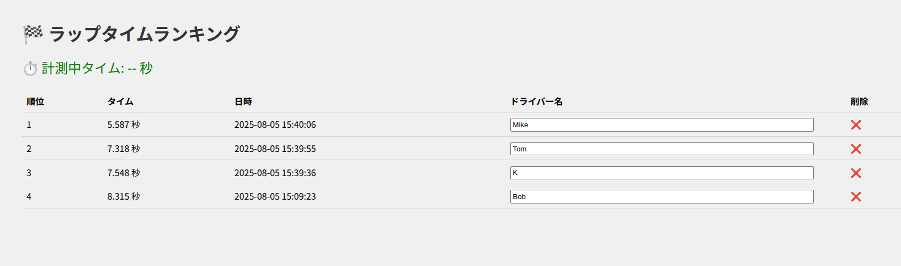
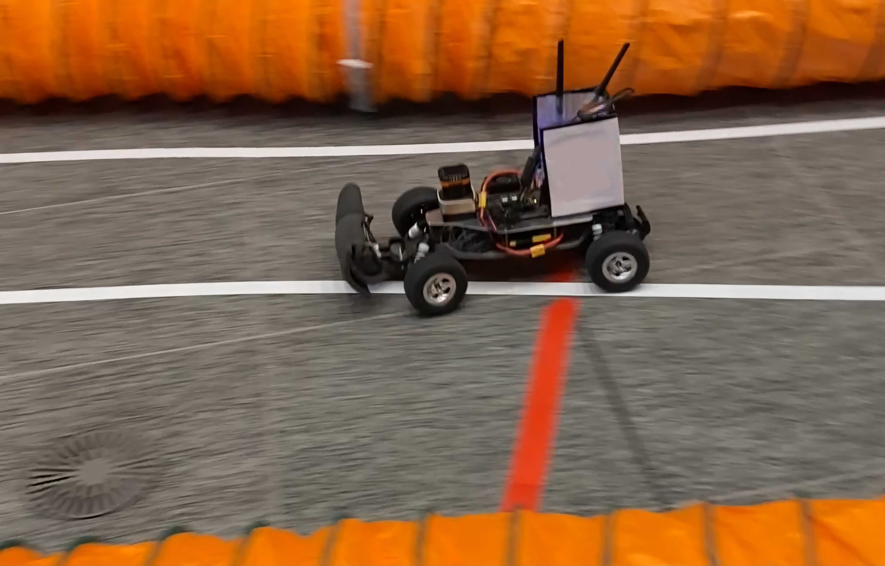

# race_laptime_tracker



RCカーレース向けのラップタイム計測システムです。スタートライン上のコース端に設置したHokuyo 2D LiDARを使用してスタート＆ゴールを検知し、Web UIで結果を表示します。



---

## ✅ 概要

#### 機能
- 1周あたりのラップタイムを計測
- Web上のUIページにタイムをランキング形式で表示
- 再起動後もデータを保持
#### UI表示項目
- 走行中の経過タイム
- 過去のラップタイム一覧
- 日時
- ドライバー名（UI上で編集可能）
- 削除ボタン

---

## 🔧 動作環境

- Ubuntu 22.04
- ROS 2 Humble
- Hokuyo URG (UST-20LX)

---

## 🖥️ 使用技術

#### バックエンド
- Flask
- SocketIO
#### フロントエンド
- HTML/CSS/JavaScript
- Socket.IO

---

## 📁 構成

### laser_processor
#### laser_processor.cpp
2D LiDAR点群のうち視野角を小さく絞り、観測距離が閾値以下かどうかをTrue/Falseでpublishする
### lap_recorder
#### lap_timer_node.py
True受け取りを車両通過とみなし、タイム計測を開始/終了する
1度の通過における重複処理防止のため5秒間のデバウンスタイムを設定
#### web_publish_node.py
ラップタイムを送信
### laptime_webui
#### app.py
ラップタイムの履歴を読み込み、受け取った新たな記録とともにランキング形式に並べ替え
#### index.html
Socket.IOでリアルタイムにUI表示

---

## 📦 インストール

```bash
cd ~/ros2_ws/src

# 本リポジトリを追加
git clone https://github.com/iASL-Gifu/race_laptime_tracker.git

mkdir hokuyo_urg

cd hokuyo_urg/

# LiDARドライバを追加
git clone https://github.com/ros-drivers/urg_node.git -b ros2-devel
git clone https://github.com/ros/diagnostics.git -b ros2
git clone https://github.com/ros-perception/laser_proc.git -b ros2-devel
git clone https://github.com/ros-drivers/urg_c.git -b ros2-devel
git clone https://github.com/ros-drivers/urg_node_msgs.git -b master

cd ~/ros2_ws

colcon build
```

---

## 🚀 起動方法

### 1. 接続
- LiDARをPCに接続する。

### 2. プログラムの実行
#### ターミナル1
```bash
source install/setup.bash
ros2 run urg_node urg_node_driver --ros-args -p ip_address:="192.168.0.10"
# ↑ LiDARのIPアドレス
```
#### ターミナル2
```bash
source install/setup.bash
ros2 run laser_processor laser_processor
```
#### ターミナル3
```bash
source install/setup.bash
ros2 run lap_recorder lap_timer_node
```
#### ターミナル4
```bash
source install/setup.bash
ros2 run lap_recorder web_publisher_node
```
#### ターミナル5
```bash
python3 ~/ros2_ws/src/race_laptime_tracker/laptime_webui/laptime_webui/app.py
```

### 3. UIページの起動
- Webブラウザで `localhost:5000` にアクセスする。
